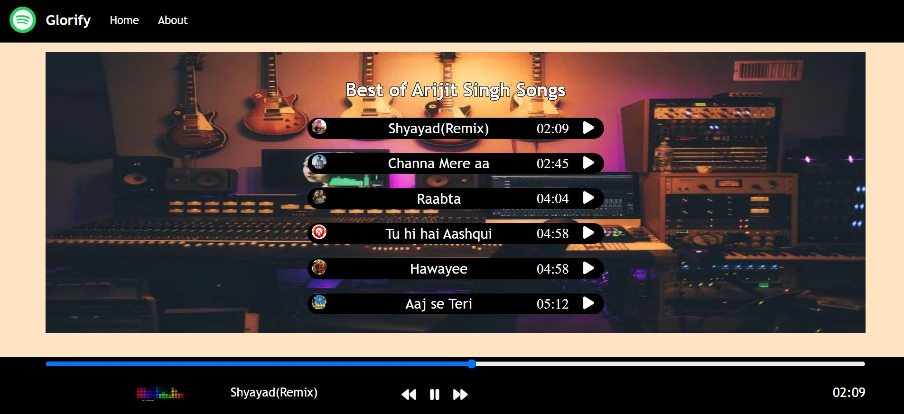

# ⭐ Project - Music Player  ⭐

This  project of javascript is made from pure HTML,CSS and Javascript.

I got this assignment from iNeuron Bootcamp.

 

📌 Learnings:

👉 1\. Html, Css and DOM manipulation.  
👉 2\. Audio Element, play, pause, currentTime and duration 
👉 3\. Seprating each functionality into smaller chunks. 
👉 4\. Managing Objects, Handling Event Listeners. 
👉 5\. How to convert total seconds into mm:ss format. 

 

> Time taken to build this project is 5 hour.

  

## Links

[Live](https://javascriptmyloancalculator.netlify.app/)

[Linkedin](https://www.linkedin.com/in/pratyush-kesarwani-2b6601171/)

### Acknowledgements:

I am thankful to Hitesh Choudhary sir, Anurag sir and iNeuron team for this amazing bootcamp.
